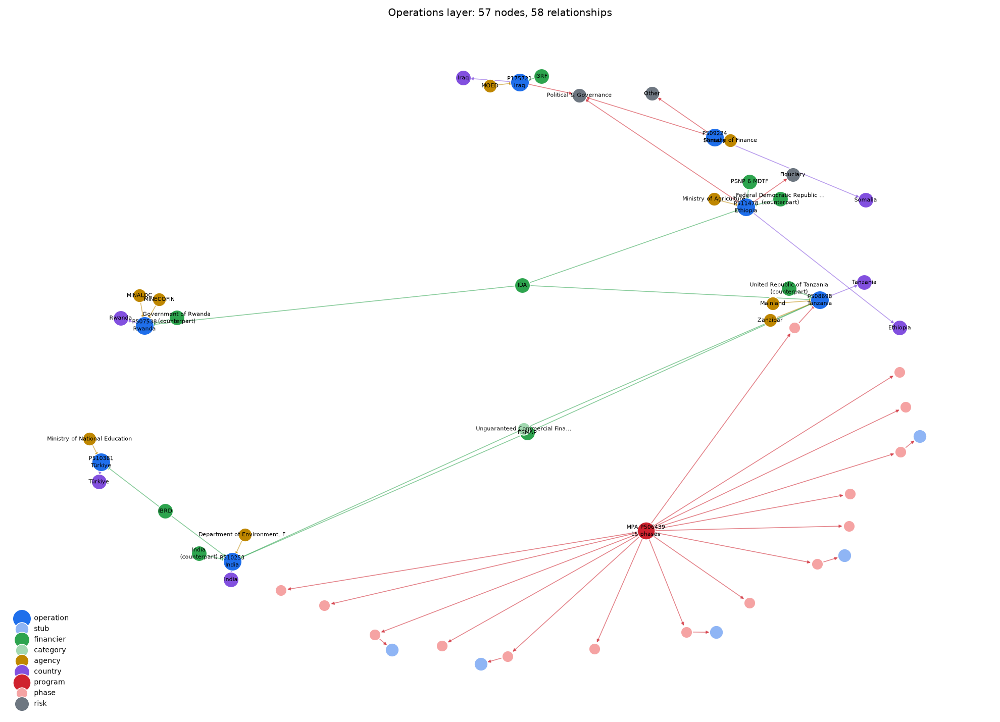
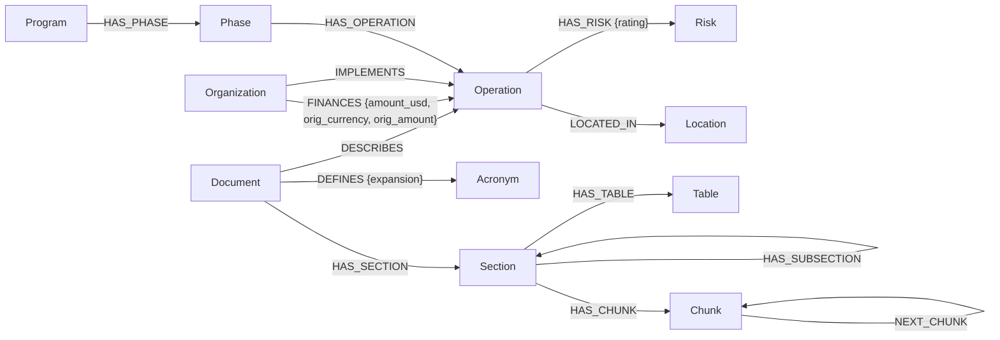
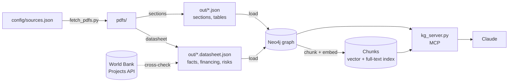

# kg-pipeline

A knowledge graph and hybrid retrieval over World Bank operation documents, served to Claude over MCP.

> [!NOTE]
> **Toy project.** This is a personal learning project to test graph-based RAG on a small corpus of 7 publicly disclosed World Bank appraisal documents. It is not production software.
> - Eval scores and Q&A examples come from test runs on this corpus with a small hand-written question set. They are not a benchmark.
> - Not affiliated with, endorsed by, or representative of the World Bank Group. Source documents are fetched from documents.worldbank.org by `scripts/fetch_pdfs.py` and are not redistributed here.
> - Extracted data may contain parsing errors; check any figure against the source document before relying on it.



<sub>The operations layer: operations, financiers, implementing agencies, countries, the MPA program and its 15
phases, and High risk ratings. Interactive version: [docs/img/operations_graph.html](docs/img/operations_graph.html)
(render with `scripts/render_graph.py`).</sub>

## What it does

- **Extracts** each PDF's sections (typed against a canonical list), tables, datasheet facts (financing with the
  original loan currency, SORT risk ratings, instruments, MPA phases, agencies) and abbreviation lists, and
  cross-checks the datasheet against the World Bank Projects API.
- **Loads** a Neo4j graph: operations, organizations, financing, risks, countries, MPA programs and phases,
  documents with their section tree, tables and acronyms. Every step uses MERGE with deterministic IDs.
- **Retrieves** over section-bounded chunks embedded with `BAAI/bge-base-en-v1.5`: vector and full-text search
  merged by reciprocal rank fusion, filterable by operation, country, section type and scope, with per-operation
  grouping and acronym expansion.
- **Serves** it to Claude through an MCP server with `graph_schema`, `graph_query` (read-only Cypher),
  `retrieve` and `ingest_pdf`, whose instructions tell the model when to query the graph, when to retrieve text,
  and how to combine them.

## Corpus

| Country | Project | Operation | Document | Instrument | Date | Pages | WBG financing (US$M) |
|---|---|---|---|---|---|---|---|
| Ethiopia | P511478 | Productive Safety Net Project 6 | Project Appraisal Document | IPF | 2026-02 | 57 | 200.0 (IDA) |
| India | P510253 | Uttar Pradesh Clean Air Management Program | Program Appraisal Document | PforR | 2025-11 | 54 | 299.7 (IBRD) |
| Iraq | P175721 | Innovations Towards Learning in Lagging Iraqi Governorates | Project Appraisal Document | IPF | 2022-05 | 58 | — (US$10.0M trust fund) |
| Rwanda | P507538 | Revenue Improvement and Spending Efficiency PforR Operation | Program Appraisal Document | PforR | 2025-10 | 48 | 100.0 (IDA) |
| Somalia | P509224 | Somalia Contingent Emergency Response Project | Project Paper | IPF (CERP) | 2025-06 | 23 | — (funded only when activated) |
| Tanzania | P508698 | Sustainable Rural Water Supply and Sanitation Program Phase II | Program Appraisal Document | PforR, MPA phase 2 of 15 | 2025-09 | 111 | 200.0 (IDA) |
| Türkiye | P510381 | Education for Job Market Readiness | Project Appraisal Document | IPF | 2025-11 | 49 | 411.0 (IBRD; EUR 350M) |

URLs and SHA-256 hashes are in [`config/sources.json`](config/sources.json); `scripts/fetch_pdfs.py` downloads and
verifies them.

## Graph schema



Current size: 7 documents, 12 operations (5 are MPA phases known only by ID), 15 phases, 19 organizations,
9 risk categories, 350 acronyms, 205 sections, 252 tables, 976 chunks. Details — properties, ID scheme, what each
stage does — are in [docs/architecture.md](docs/architecture.md).

## Architecture



| Stage | Module | Notes |
|---|---|---|
| Sections | `kg_pipeline.sections` | Headings from the PDF outline or from typography plus the printed table of contents; regex subtypes grouped into coarse types; tables kept only when drawn with rules; validation flags |
| Datasheet | `kg_pipeline.datasheet` | Datasheet tables by column position; original currencies from the cover; MPA phases reconciled against the program envelope; Projects API v3 + v2 cross-check |
| Load | `kg_pipeline.load` | Plan, then batched MERGE; `--dry-run`; stale sections removed; contact details dropped |
| Chunk | `kg_pipeline.chunk` | ~400-token windows, 50 overlap, never crossing sections; tables as markdown by rows; glossary chunks; cached embeddings |
| Retrieve | `kg_pipeline.retrieve` | Vector + full-text top 20 each after filters, RRF; `per_project_k`; acronym expansion |
| Serve | `src/kg_server.py` | MCP tools and routing instructions |

## Evaluation

Three modes, on shared question files ([eval/README.md](eval/README.md)):

| Mode | What it measures | Result |
|---|---|---|
| Retrieval-only (baseline) | Unfiltered hybrid search: expected projects and section types in the top 8 | 19/22 (MRR 0.62) |
| Oracle (upper bound) | The same search with filters from the answer key — what perfect routing could retrieve | 22/22 (MRR 1.00) |
| **End-to-end (realistic)** | **Claude Code with only this MCP server: right tools called, expected IDs and facts in the answer, nothing invented** | **17/17** |

The end-to-end number is the one to quote. It comes from one run (2026-09-27, Claude Code's default model,
111 s wall clock with 3 parallel questions, $4.01 reported cost) and varies between runs; earlier runs scored
14/17 and 16/17 before the fixes and scoring changes recorded in the [scorer change log](eval/README.md#scorer-changes)
and [docs/lessons.md](docs/lessons.md).

### Example Q&A

Full traces from that run — each tool call with its arguments, a trimmed result, and the answer:

- [Which operations rate fiduciary risk High, and why?](examples/qa-graph-then-retrieve.md) — graph query, then retrieval
- [Which operations rate fiduciary risk Substantial, and what mitigations do they propose?](examples/qa-per-project-k.md) — five operations in one `retrieve` call with `per_project_k`
- [What lessons from previous projects shaped the Iraq project's design?](examples/qa-section-type-retrieval.md) — retrieval filtered by section type
- [What are the key risks of the Kenya education project?](examples/qa-not-in-corpus.md) — not in the corpus; the answer says so

## Quickstart

Requires Python 3.12, [uv](https://docs.astral.sh/uv/), a Neo4j 5 database (a free
[Aura](https://neo4j.com/cloud/aura/) instance works) and, for the MCP server and e2e eval,
[Claude Code](https://docs.claude.com/en/docs/claude-code).

```bash
uv sync                                   # pinned dependencies (add --extra viz for render_graph.py)
cp .env.example .env                      # fill in the Neo4j connection
uv run python scripts/fetch_pdfs.py       # 7 PDFs into pdfs/, SHA-256 verified

uv run python -m kg_pipeline.sections     # -> out/<pdf>.json
uv run python -m kg_pipeline.datasheet    # -> out/<pdf>.datasheet.json (queries the Projects API; cached)
uv run python -m kg_pipeline.load         # -> Neo4j   (--dry-run to preview counts)
uv run python -m kg_pipeline.chunk        # -> Neo4j   (--dry-run to preview; first run downloads the model)

uv run python -m kg_pipeline.retrieve "What lessons from previous projects shaped the design?"
```

Register the MCP server with Claude Code (it reads `.env` from the repository, so no credentials go on the
command line):

```bash
claude mcp add --scope user kg -- "$PWD/.venv/bin/python" "$PWD/src/kg_server.py"
```

Then ask, for example, "Which operations rate fiduciary risk High, and why?". More queries and retrieval calls
are in [examples/](examples/). Evaluate with `uv run python eval/eval.py` (no LLM) and
`uv run python eval/run_e2e.py` (Claude Code; ~2 minutes and ~$4 for the full set). Regenerate the example
traces from a run with `uv run python scripts/export_examples.py`.

## Layout

```
config/     section types, organization aliases, country map, source manifest (URLs + SHA-256)
src/        kg_pipeline package and kg_server.py (MCP)
scripts/    fetch_pdfs.py, render_graph.py, export_examples.py
eval/       retrieval-only, oracle and end-to-end evals with their question sets
examples/   Q&A traces, Cypher queries, retrieval calls, an MCP config
docs/       architecture, lessons learned, graph images
```

`pdfs/`, `out/`, `cache/` and `eval/runs/` are generated and gitignored.

## Known limitations

- **Seven documents, World Bank templates only.** Heading detection expects the appraisal-document and
  project-paper layouts (`I.`, `A.`, `ANNEX n`, printed tables of contents); other templates will need patterns
  in `config/section_types.json`, and some headings in new documents may land in `other`.
- **Expected, not actual, dates.** Approval and closing dates on operations are the documents' expected dates;
  the Projects API's actual dates are stored alongside as `*_api` and differ for two operations.
- **Stub phase operations.** MPA phases other than Tanzania's are known only by project ID (and 9 of 15 have no
  ID yet); nothing about them comes from their own documents.
- **Datasheet parsing is template-bound.** It reads the datasheet's table layout; a changed template can leave
  fields unparsed (they are flagged, not guessed).
- **The Projects API is incomplete.** v3 lacks instrument and practice area; v2 lacks most recent projects.
  Region and status fall back to values derived from the PDF and are marked as such.
- **Single-document ingestion validates in isolation.** `ingest_pdf` can't compare section sizes against the
  corpus, so its size-outlier flags differ from a full run.
- **Scoring is string matching.** e2e checks look for IDs and facts in the answer text; they miss paraphrases
  and can pass a partly wrong answer. Read `results.md` for anything that matters.
- **English only**, and one embedding model (768-d, 512-token input).

## License

Code is MIT. Depends on PyMuPDF, which is licensed AGPL-3.0.
